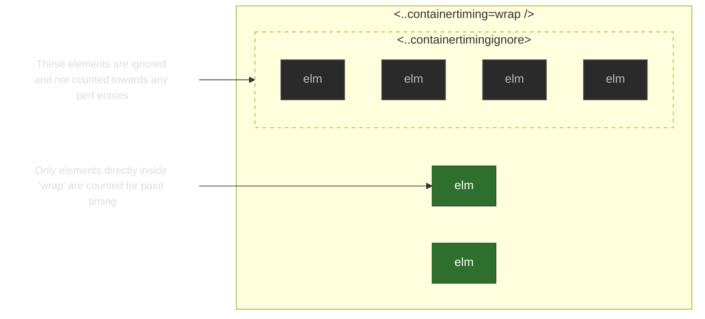

# Container Timing: Explainer

_Note: This API plans to go to [Origin Trial](./ORIGIN_TRIAL.md) during Chrome m148-153, please try it out!_

## Authors

- Jason Williams (Bloomberg)
- José Dapena Paz (Igalia)

## Participate

- [Explainer Issues](https://github.com/WICG/container-timing/issues)
- [Github Repo](https://github.com/WICG/container-timing)

## Table Of Contents

1. [Authors](#authors)
1. [Introduction](#introduction)
1. [Goals](#goals)
1. [Objectives](#goals)
1. [Using The API](#using-the-api)
1. [Life Cycle](#life-cycle)
1. [Non Goals](#non-goals)
   1. [LCP Integration](#lcp-integration)
   1. [Built-in containers](#built-in-containers)
   1. [Shadow DOM](#shadow-dom)
1. [Security and Privacy](#security-and-privacy)
1. [How do we try this?](#how-do-we-try-this-out)
   1. [Chrome Origin Trial](#chrome-origin-trial)
   1. [Browser Extension](#browser-extension)
1. [Considered alternatives](#considered-alternatives)
1. [Questions](#questions)
1. [W3C Specification Meetings](#w3c-specification-meetings)
1. [Standards Positions](#standards-positions)
1. [Glossary](#glossary)
1. [Links](#links--further-reading)
1. [Reference](#references--acknowledgements)

## Introduction

The Container Timing API enables monitoring when annotated sections of the DOM are displayed on screen and have finished their initial paint.
A developer will have the ability to mark subsections of the DOM with the `containertiming` attribute (similar to `elementtiming` for the [Element Timing API](https://developer.mozilla.org/en-US/docs/Web/API/PerformanceElementTiming)) and receive performance entries when that section has been painted for the first time. This API will allow developers to measure the timing of various components in their pages.

Unlike with Element Timing, it is not possible for the renderer to know when a section of the DOM has finished painting (there could be future changes, asynchronous requests for new images, slow loading buttons, etc.). This API will produce [`PerformanceEntry`](https://developer.mozilla.org/en-US/docs/Web/API/PerformanceEntry) objects when there has been an update to the `containertiming` region. Updates are defined as paints in new areas as-yet unpainted, these entries will have details such as "How much has painted since last time", "which element was the last to paint" and "what is the total area of paints so far".

See also: https://blogs.igalia.com/dape/2026/02/10/container-timing-measuring-web-components-performance/

## Motivation

As developers increasingly organise their applications into components, there's growing demand to measure performance of subsections of an application or web page. For instance, [a developer may want to know](https://groups.google.com/g/web-vitals-feedback/c/TaQm0qq_kjs/m/z1AGXE0MBQAJ?utm_medium=email&utm_source=footer) when a subsection of the DOM has been painted, like a table or a widget, so they can mark the paint time and submit it to their analytics.

Current Web APIs don't help with this. Element Timing is [limited](https://w3c.github.io/paint-timing/#timing-eligible) due to what it can mark, so it can't be used for whole sections. The polyfill referenced below attempts to provide a userspace solution by adding Element Timing to all elements within a container and using the data from those performance entries to know when painting has finished. This approach has several drawbacks though:

- Marking elements with the `elementtiming` attribute needs to happen as early as possible before painting happens; this will require server-side changes or blocking rendering until all elements are marked (degrading performance)
- A [MutationObserver](https://developer.mozilla.org/en-US/docs/Web/API/MutationObserver) needs to be utilised to catch new elements being injected into the DOM (with `elementtiming` being set)
- The polyfill will need to run and perform set up in the page header, increasing the time to first paint
- Tracking of rectangles will need to be performed in userspace rather then the browser's built in 2D engine, making it much less efficient

Developers know their domain better than anyone else and they would like to be able to communicate the performance of their own blocks of content in a way that their users or organisation would understand, for example ["time to first tweet"](https://youtu.be/1jGaov-4ZcQ?si=lwk3mIRuwvxxWCDQ&t=2907).

Being able to mark a segment of content and asking the rendering engine to identify when that has been painted is a growing request by developers.

## Goals

1. Inform developers when sections of the DOM are first displayed on the screen. To keep the first version of this spec simpler, we are not including shadow DOM in this version, as this still needs to be understood for `elementtiming`.
2. Inform developers when those same sections of the DOM have finished their initial paint activity (indicating this section is ready for viewing or interacting with).

## Non-Goals

### LCP Integration

This is not intended to provide changes to the [Largest Contentful Paint](https://developer.mozilla.org/en-US/docs/Web/API/LargestContentfulPaint) algorithm. Although LCP could benefit in the future from user-marks of content which are containers and receiving paint times from those to choose better candidates, it's not currently in scope whether this will have any affect on existing browser metrics.

### Built-in containers

The changes here are also not going to add support to built-in composite elements such as MathML or SVG. It's possible for a follow-up proposal in the future to mark those elements as containers so they can be counted for higher-level metrics, such as LCP, and added to the results when observing container timing.

### Shadow DOM

Currently, Element Timing [doesn't have support for shadow DOM](https://github.com/WICG/element-timing/issues/3). There will need to be many architecture-decisions made on how the shadow DOM interacts with Element Timing (should it be opened up or closed, should individual elements be surfaced or just the shadow host element). Once we have a good story for Element Timing, we can have a later proposal for Container Timing too (which hopefully follows similar rules to the Element Timing API).

## Using the API

As with [Element Timing](https://github.com/WICG/element-timing), registration will be on a per-element basis. An element with a `containertiming` attribute will have itself and its whole sub-tree registered for container timing. There is currently no plan for implicit registration; see [Built-in containers](#built-in-containers).

Example:

```html
<div … containertiming="foobar"></div>
...
<script>
  const observer = new PerformanceObserver((list) => {
    let perfEntries = list.getEntries();
    // Process the entries by iterating over them.
  });
  observer.observe({ entryTypes: ["container"] });
</script>
```

It is strongly encouraged to set the attribute before the element is added to the document (in HTML, or if set in JavaScript, before adding it to the document). Setting the attribute retroactively will only give you subsequent events and any future paints that haven't happened yet.

This is the preferred method of annotating container roots, as it gives developers the power to decide which elements they consider important.

### PerformanceContainerTiming

We now describe precisely what information is exposed via the WebPerf API. The PerformanceContainerTiming IDL attributes are defined as followed:

- `entryType`: `"container"`
- `startTime`: A [DOMHighResTimeStamp](https://developer.mozilla.org/en-US/docs/Web/API/DOMHighResTimeStamp) of the latest container paint time
- `identifier`: The value of the element's containertiming attribute (empty string if it does not have it)
- `intersectionRect`: The bounding box of all paints accumulated so far within this container
- `size`: The size of the combined region painted (so far) within this container
- `firstRenderTime`: A [DOMHighResTimeStamp](https://developer.mozilla.org/en-US/docs/Web/API/DOMHighResTimeStamp) of the first paint time for this container
- `duration`: A [DOMHighResTimeStamp](https://developer.mozilla.org/en-US/docs/Web/API/DOMHighResTimeStamp) set to 0
- `lastPaintedElement`: An [Element](https://dom.spec.whatwg.org/#concept-element) set to the last painted element (this may need to be a set of elements painted)

### Ignoring parts of the DOM

If you want wish to ignore parts of the DOM tree you are monitoring, you can add the `containertimingignore` attribute to the element you want to ignore (plus its children).

```html
<div … containertiming="foobar">
  <main>...</main>
  <!-- We don't want to track paint udpates in the aside -->
  <aside containertimingignore>...</aside>
</div>
```

## Life Cycle

<picture>
  <source media="(prefers-color-scheme: dark)" srcset="./docs/img/life-cycle-dark.svg">
  <source media="(prefers-color-scheme: light)" srcset="./docs/img/life-cycle-light.svg">
  
</picture>



## Security and Privacy

The cross-frame boundary is not breached: elements belonging to iframes are not exposed to the parent frames. No timing information is passed to the parent frame unless the developer themselves explicitly passes information via postMessage.

Most of the information provided by this API can already be estimated, even if in tedious ways. Element Timing returns the first rendering time for images and text. The PaintTiming API could be used to compute a related timestamp for all the elements within a container root (see [Polyfill](#heading=h.3wxxpyowvuit)).

## How do we try this out?

## Chrome Origin Trial

See: [Origin Trial](./ORIGIN_TRIAL.md)

## Chrome Canary and Chrome Beta

Container Timing is now available in Chrome Canary behind a flag. To enable it:

1. Ensure your Chromium is recent enough (v145 and upwards)
1. Open `chrome://flags/#enable-experimental-web-platform-features`
1. Set it to `Enabled`
1. Restart the browser
1. [Optional] You can also launch Chrome with the flag `--enable-blink-features=ContainerTiming`
1. Open DevTools, go to the console and run `PerformanceObserver.supportedEntryTypes`, you should see `container` in the list of supported entry types.
1. See the [Examples](./examples) section for examples on using the Container Timing API

### Browser Extension

You can try out the Chrome extension [here](./chrome-extension/README.md). You will need to build it manually for now and load the browser with it set as an argument. For the extension to work, you will need to have the experimental web platform features flag enabled in Chrome (see above).

Once you have the browser running with Container Timing enabled, you can run:

- `$ npm i`
- `$ npm run start`

in the root of this repo and it should load up the examples for you to try out.

## Considered alternatives

### Element Timing everywhere

Element Timing can be applied to any element by the developer, but it is too limited in what it can support. Developers wanting to measure when a component is ready would need to apply the attribute to every element, which is cumbersome and sometimes infeasible (when the component is not authored by them). On top of this, Element Timing wouldn't take into account new elements coming into the DOM at a later stage.

### Largest Contentful Paint

For the reasons mentioned in the [Motivation](#motivation), Largest Contentful Paint (LCP) isn't useful enough to time when specific parts of the page have loaded. It utilizes Element Timing for its functionality and thus has the same shortcomings as Element Timing.

### User-space polyfill in JavaScript

As mentioned in the [Motivation](#motivation), the polyfill would need a few things in place to work properly and can add overhead to the web application.
The polyfill will need to mark elements with `elementtiming` as soon as possible, especially before the browser begins painting. In order to achieve this, the polyfill will need to run in the head, block rendering, and scan the DOM for a `containertiming` attribute and modify the children elements to add the `elementtiming` attributes to all "eligible" child nodes.

After marking elements in the initial DOM, the polyfill will then need to setup a MutationObserver to watch for changes in the tree and tag newly-incoming elements with the `elementtiming` attribute before they are painted. This can lead to a race condition where the element may paint before the attribute is applied and Element Timing is taken into effect.

Finally, tracking of all rectangles in userspace may not be as efficient as the browser's built-in 2D library, and thus can incur memory overhead.

## Questions

- How do we register containers? Can it be done dynamically? (More [here](./docs/container-definitions.md))
- Setting the `containertiming` attribute far up the tree could cause a lot of processing. As the depth is infinite, we may need to have some limit or default depth set.
- ~~We will want to add some way for developers to ignore certain blocks of elements without using an inner container (which would degrade performance).~~
- As most developers will be using this for startup metrics (similar to LCP), do we want to offer an option to stop tracking on user input?
- As the browser paints in batches, lastPaintedElement may need to be an array of elements.

## W3C Specification Meetings

December 7th 23:

- [Minutes](https://docs.google.com/document/d/1Tjm2kvIkdlnxArAMQ5zfqo5OoKFmhYUDG3GZvGlz9Xc/edit#heading=h.tl59px9yt6pi)
- [Recording](https://www.youtube.com/watch?v=MjGVtshDN7U)

February 15th 2024:

- [Minutes](https://docs.google.com/document/u/0/d/1EcAMmI678Wm3JheS61cwoX-hkjPWPbXkg7dX1iFlSOA)
- [Recording](https://www.youtube.com/watch?v=--BqFf6Zxg0)

May 23rd 2024:

- [Minutes](https://docs.google.com/document/d/1EG9MWk8GHHCstIKLAgR6mk118guriEx6LQzx-37Li5c/edit#heading=h.r089wa3vnlz2)
- [Recording](https://www.youtube.com/watch?v=huLJguS24rc)

TPAC 2024:

- [Minutes](https://docs.google.com/document/d/1wL8Re4atVHVpfKTxhFfh8TNkkK4VCBbVJ-U70q5PWjo/edit?tab=t.0#heading=h.bpc0vp4oji3n)
- [Recording](https://www.youtube.com/watch?v=6ZUR41ouOzM)

Discussion around Shadow DOM:

- [Minutes](https://docs.google.com/document/d/11ou0LSZgodO6PIpd0jmgPhAr0HBNIQPwaEkET-FtfG8/edit?tab=t.0#heading=h.4pq5k0px46wq)

TPAC 2025:

- [Minutes](https://docs.google.com/document/d/1EbG3VL27YlzQj8bnWVRI-OUHm6WcUowYoxjYOu4RlXM/edit?tab=t.0#heading=h.lmryijwx1ur8)

## Standards Positions

- Chromium: Implemented behind flag in Canary and Beta
- Firefox: [Waiting on response](https://github.com/mozilla/standards-positions/issues/1155)
- Webkit: [Waiting on response](https://github.com/WebKit/standards-positions/issues/442)

## Glossary

- **Region**: This is an object which efficiently holds Rects and can calculate overlaps between them plus various other things such as total size etc. In Chromium this would be a [Skia](https://skia.org/) or [SkRegion](https://api.skia.org/classSkRegion.html), Firefox's Moz2D and Webkit's CoreGraphics libraries should have equivalent concepts.
- **Container Root**: This is an element which has the "containertiming" attribute applied

## Links & Further Reading

- [https://tag.w3.org/explainers/](https://tag.w3.org/explainers/)
- [Pushing Pixels | Mark Zeman | performance.now() 2023](https://www.youtube.com/watch?t=2907&v=1jGaov-4ZcQ&feature=youtu.be)
- [Element Timing For Containers](https://www.youtube.com/watch?v=MjGVtshDN7U)
- [Element Timing for Text](https://docs.google.com/document/d/1xhPJnXf0Nqsi8cBFrlzBuHavirOVZBd8TqdD_OyrDGw/edit)
- [Element Timing Implementation Proposal](https://docs.google.com/document/d/1BvHknbj3T-fUuj4RxHF8qGRNxbswtBqUjKiPx7iLXCc/edit#heading=h.sgo0q1rfaa9b)
- [Container Timing: Measuring Web Components Performance](https://blogs.igalia.com/dape/2026/02/10/container-timing-measuring-web-components-performance/)

## References & acknowledgements

Many thanks for valuable feedback and advice from:

- [Barry Pollard](https://github.com/tunetheweb)
- [Michael Mocny](https://github.com/mmocny)
- [Scott Haseley](https://github.com/shaseley)
- [Sergey Chernyshev](https://github.com/sergeychernyshev)
- [Bas Schouten](https://hacks.mozilla.org/author/bschoutenmozilla-com)
